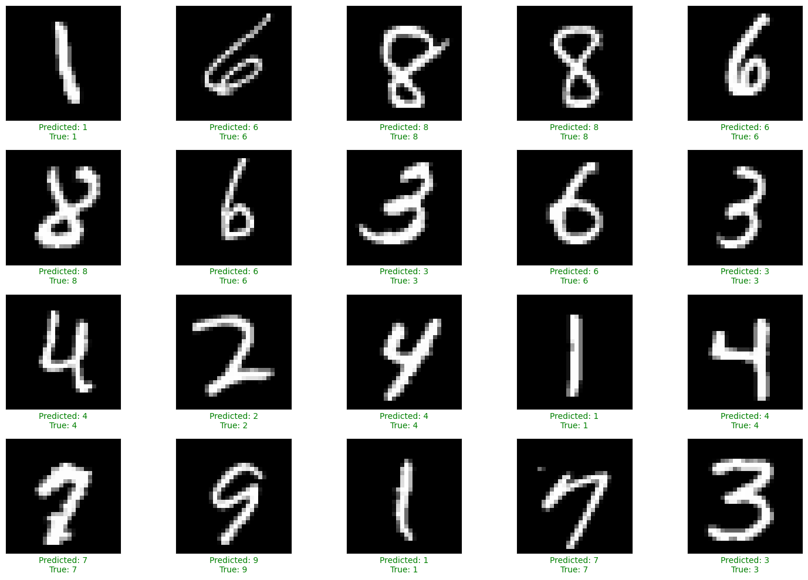
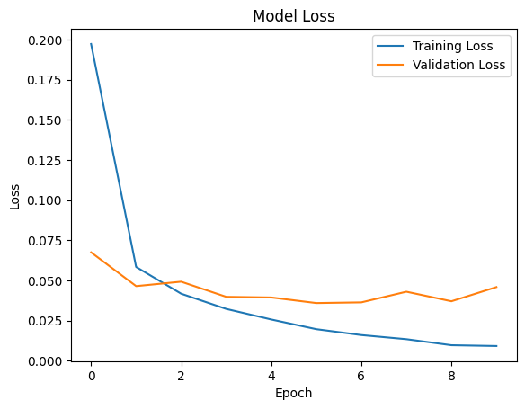
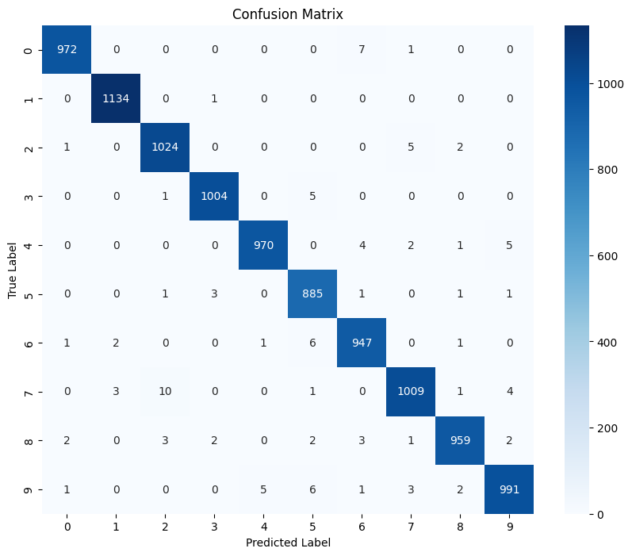

# Convolutional Neural Network for MNIST Classification

## Overview
This script trains a convolutional neural network (CNN) to classify handwritten digits from the MNIST dataset. The CNN architecture consists of multiple convolutional and pooling layers followed by fully connected layers. The model is trained using the Adam optimizer and categorical crossentropy loss function.



## Key Features
- Convolutional neural network (CNN) architecture
- Training on the MNIST dataset
- Evaluation using test set accuracy



- Confusion matrix visualization



## How to Install
1. Clone this repository to your local machine.
2. Install the dependencies:
``` bash
pip install numpy keras tensorflow scikit-learn matplotlib seaborn
```
3. Run numberPredict.py
``` bash
python numberPredict.py
```

## Credits
- The MNIST dataset was obtained [here](https://storage.googleapis.com/tensorflow/tf-keras-datasets/mnist.npz).
- This code is inspired by Jousef Murad's Image Classification Model Project on Coursera.

